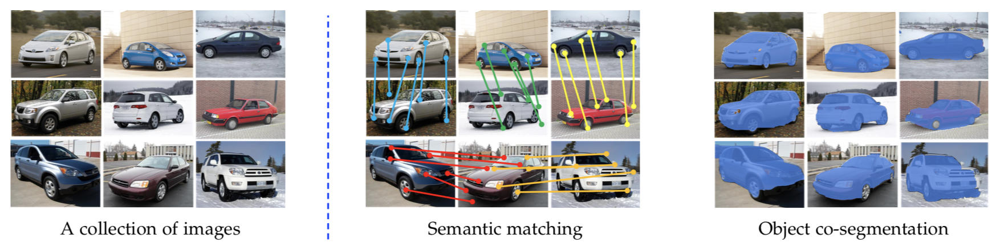

# Show, Match and Segment: Joint Learning of Semantic Matching and Object Co-segmentation

This repository contains the source code for the paper Show, Match and Segment: Joint Learning of Semantic Matching and Object Co-segmentation.



## Citation
If you find our code useful, please consider citing our work using the following bibtex:
```
@article{MaCoSNet,
    title={Show, Match and Segment: Joint Learning of Semantic Matching and Object Co-segmentation},
    author={Chen, Yun-Chun and Lin, Yen-Yu and Yang, Ming-Hsuan and Huang, Jia-Bin},
    journal={arXiv},
    year={2019}
}

@inproceedings{WeakMatchNet,
  title={Deep Semantic Matching with Foreground Detection and Cycle-Consistency},
  author={Chen, Yun-Chun and Huang, Po-Hsiang and Yu, Li-Yu and Huang, Jia-Bin and Yang, Ming-Hsuan and Lin, Yen-Yu},
  booktitle={Asian Conference on Computer Vision (ACCV)},
  year={2018}
}
```

## Environment
 - Install Anaconda Python3.7
 - This code is tested on NVIDIA V100 GPU with 16GB memory
 
``` 
pip install -r requirements.txt
```

## Dataset
 - Please download the [PF-PASCAL](http://www.di.ens.fr/willow/research/proposalflow/dataset/PF-dataset-PASCAL.zip), [PF-WILLOW](http://www.di.ens.fr/willow/research/proposalflow/dataset/PF-dataset.zip), [TSS](https://drive.google.com/file/d/0B-VxeI7PlJE1U3FyTGVpbUFtcjg/view?usp=sharing), and [Internet](http://people.csail.mit.edu/mrub/ObjectDiscovery/ObjectDiscovery-data.zip) datasets
 - Please modify the variable `DATASET_DIR` in `config.py` 
 - Please modify the variable `CSV_DIR` in `config.py`


## Training
 - You may determine which dataset to be the `training set` by changing the $DATASET variable in train.sh
 - You may change the $BATCH_SIZE variable in `train.sh` to a suitable value based on the GPU memory
 - The trained model will be saved under the `trained_models` folder
 
``` 
sh train.sh
```


## Evaluation
 - You may determine which dataset to be evaluated by changing the $DATASET variable in eval.sh
 - You may change the $BATCH_SIZE variable in `eval.sh` to a suitable value based on the GPU memory
 
``` 
sh eval.sh
```

## Acknowledgement
 - This code is heavily borrowed from [Rocco et al.](https://github.com/ignacio-rocco/weakalign)
